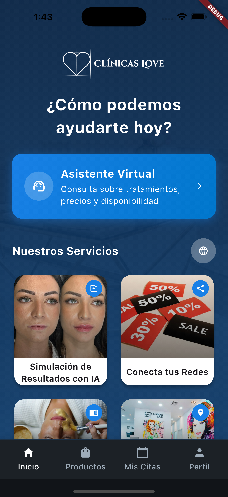
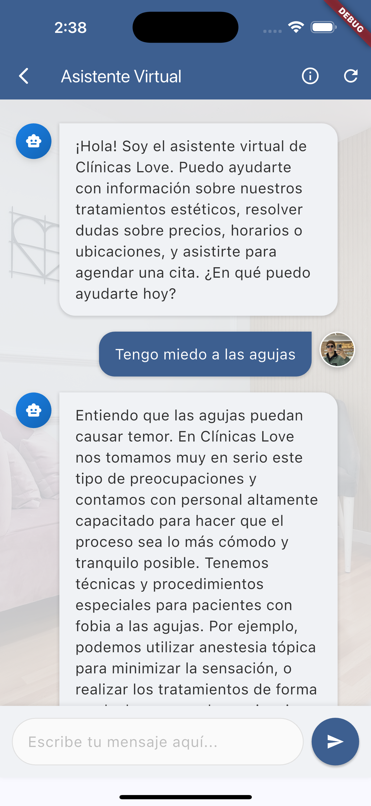
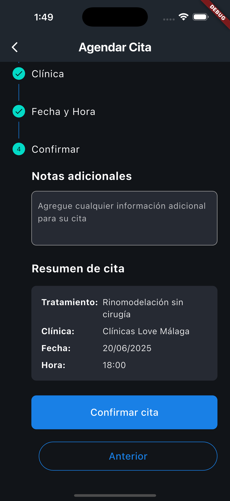
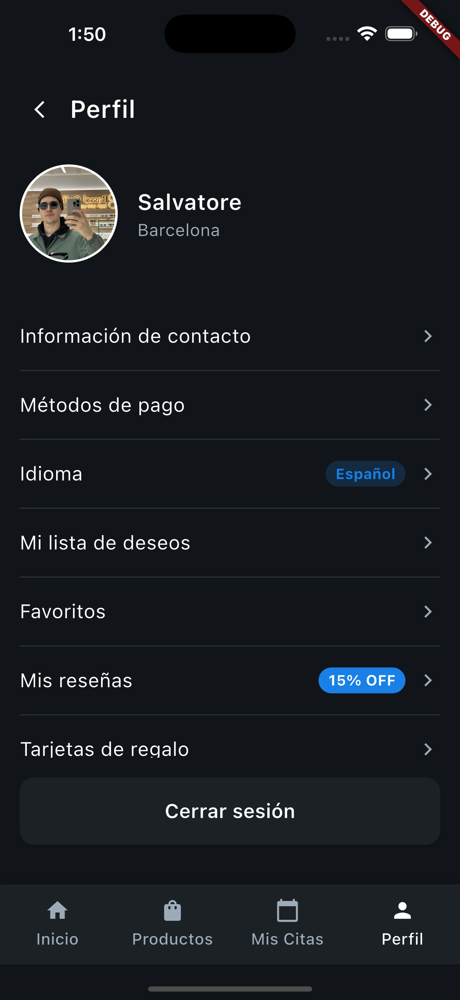

# Clínicas Love: app móvil para clínicas médico-estéticas


App móvil (iOS y Android) para mejorar la experiencia del paciente en clínicas médico-estéticas: consultas con un asistente virtual, simulación de resultados con IA, reserva de citas y toda la información de la clínica en un solo lugar.

<p>
  
  
  
  
</p>


## Qué hace

- **Asistente virtual con IA** (Claude): responde dudas sobre tratamientos, precios y disponibilidad, y guarda el historial de las conversaciones.
- **Simulador de tratamientos**: a partir de una foto, muestra una simulación del resultado (Replicate y YouCam).
- **Citas**: reserva desde la app, próximas citas e historial.
- **Clínicas cerca**: mapa con Google Maps y geolocalización.
- **Contenido educativo, ofertas, reseñas** de pacientes e **integración con redes** para compartir.
- **Perfil del paciente**, con registro, login y recuperación de contraseña.
- **Tres idiomas**: español, inglés y catalán.

## Stack

| Capa | Tecnologías |
|---|---|
| App | Flutter, Dart, Provider, Google Maps, cámara e image picker |
| Backend | Supabase (Auth, PostgreSQL, Storage) · API en FastAPI con Prisma |
| IA | Claude (asistente) · Replicate y YouCam (simulador) |
| Datos | Scraper en Python que trae los precios de la tienda online a Supabase |

## Cómo correrla

```bash
git clone git@github.com:salvaromanelli/clinicas-love-app.git
cd clinicas-love-app
flutter pub get
cp .env.example .env   # completá tus claves
flutter run
```

Variables del `.env`:

| Variable | Para qué |
|---|---|
| `SUPABASE_URL`, `SUPABASE_KEY` | Conexión con el proyecto de Supabase (clave anon) |
| `CLAUDE_API_KEY` | Asistente virtual |
| `OPENAI_API_KEY` | Funciones que usan OpenAI |
| `REPLICATE_API_KEY` | Simulador de tratamientos |
| `YOUCAM_API_KEY`, `YOUCAM_SECRET_KEY` | Simulador de tratamientos (YouCam) |

> En una app móvil, cualquier clave que viaja dentro de la app se puede extraer. En producción, las llamadas a las APIs de IA deberían pasar por un backend propio, por ejemplo una Edge Function de Supabase.

## Próximos pasos

- Integración con Clinic Cloud (Doctoralia) para sincronizar la agenda de la clínica.

## Licencia

© 2025 Salvador Romanelli. Todos los derechos reservados.

Desarrollado por Salvador Romanelli para el equipo de Clínicas Love.
